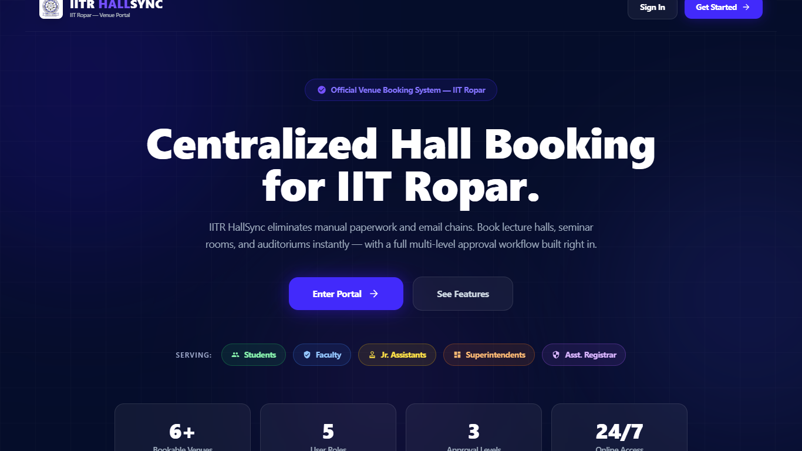
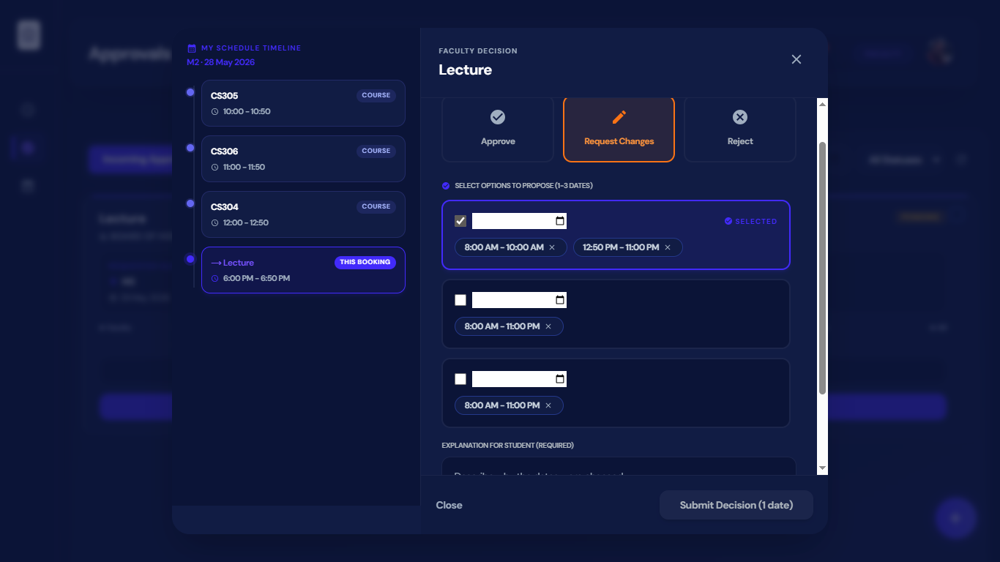
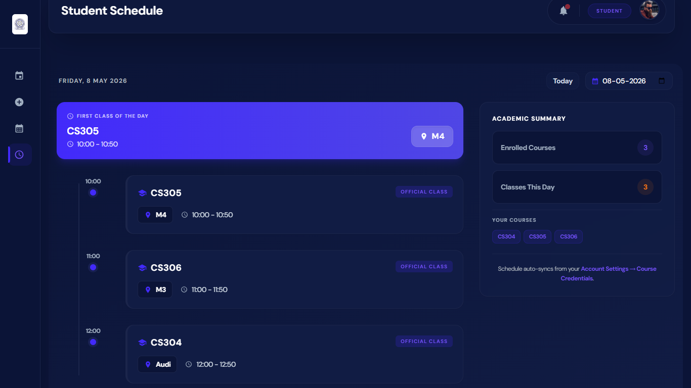
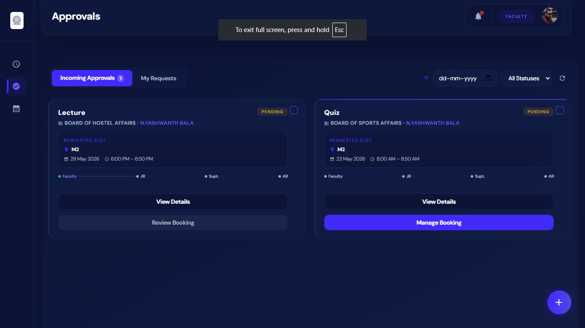
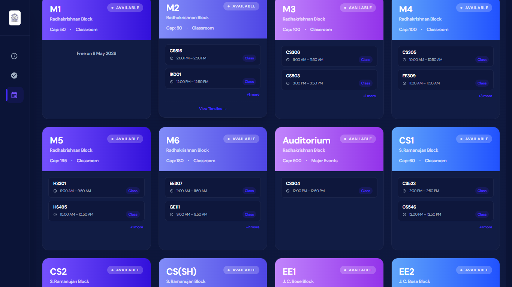
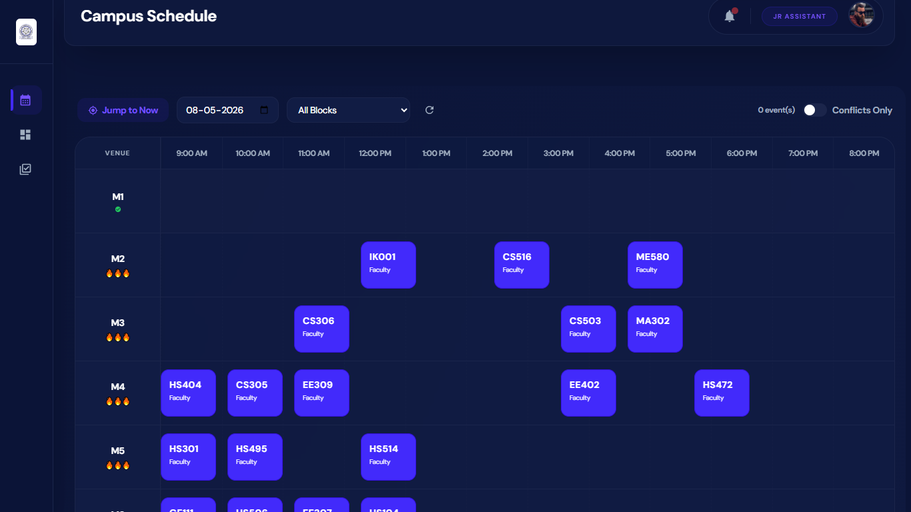

# IIT Ropar HallSync - Lecture Hall Booking Portal

HallSync is a comprehensive, role-based lecture hall and venue booking portal designed specifically for IIT Ropar. It streamlines the complex workflow of reserving campus venues for academic, club, and extra-curricular activities through an automated, multi-tier approval system.

## 🌟 Key Features

### 1. Role-Based Access Control (RBAC)
Dedicated dashboards and custom workflows for five distinct user roles:
*   **Students**: Can submit booking requests, view personal academic schedules, track request statuses, and receive dynamic E-Tickets.
*   **Faculty**: Can approve private requests from students, manage their own schedule, and oversee bookings.
*   **Jr. Assistant**: Handles triage queue, assigns specific venue slots to requests, and resolves scheduling conflicts.
*   **Superintendent**: Reviews and vets allocated slots before final sign-off.
*   **Assistant Registrar (AR) / Dean**: Provides the final executive approval, locking the decision and triggering E-ticket generation.

### 2. Multi-Tier Approval Workflow
*   **State-Machine Tracking**: A visual timeline tracker for every booking, showing real-time progress across Faculty, Jr. Assistant, Superintendent, and AR stages.
*   **Immutable Decisions**: Once a request reaches final approval, the decision is locked to prevent accidental post-approval modifications.

### 3. Smart Conflict Resolution & Scheduling
*   **Automated Conflict Checking**: Prevents venue double-booking and alerts students if a requested time overlaps with their own enrolled academic classes.
*   **Dynamic Alternatives**: Faculty and Jr. Assistants can propose alternative time slots or dates if the requested slot is unavailable.

### 4. Interactive Calendars & Schedules
*   **Campus Schedule**: A unified view of all approved and pending campus-wide events.
*   **Room Calendar**: A filterable timeline visualization to see exact availability for specific venues (e.g., M1, M2, L1).
*   **Personal Schedule**: Tailored views integrating both official academic course schedules and approved custom bookings.

### 5. Dynamic E-Ticket Generation
*   Once a booking receives final AR approval, the backend automatically generates a secure, hashed **QR Code E-Ticket**.
*   E-Tickets are fully integrated into the UI and can be presented for entry validation.

### 6. Automated Email Notifications & Magic Links
*   Email notifications sent to administrators to approve new Faculty and Student registrations via one-click magic links.

## 📸 Application Showcase

Here are some previews of the HallSync interface:

*(Note: Replace the descriptions below based on what each screenshot actually shows)*








## 🛠️ Technology Stack

*   **Frontend**: React.js, Tailwind CSS, Horizon UI Template
*   **Backend**: Node.js, Express.js
*   **Database**: MongoDB (Mongoose)
*   **Utilities**: Nodemailer (Emails), React-QR-Code (E-Tickets), Crypto (Hashing)

## 🚀 Getting Started

### Prerequisites
*   Node.js (v16+)
*   MongoDB Cluster URL

### Installation

1.  **Clone the repository**
2.  **Install dependencies for Backend:**
    ```bash
    cd backend
    npm install
    ```
3.  **Install dependencies for Frontend:**
    ```bash
    cd ../frontend
    npm install
    ```

### Environment Variables
You will need to set up your environment variables. 
*   **Backend (`backend/.env`)**: Define your `MONGO_URI`, `PORT`, `EMAIL_USER`, `EMAIL_PASS`, `ADMIN_EMAIL`.
*   **Frontend (`frontend/.env.example`)**: Define `REACT_APP_API_URL` (usually `http://localhost:5000`).

### Running the App
From the root directory, you can start both the backend and frontend concurrently (if configured), or run them in separate terminals:

**Terminal 1 (Backend):**
```bash
cd backend
npm start
```

**Terminal 2 (Frontend):**
```bash
cd frontend
npm start
```
